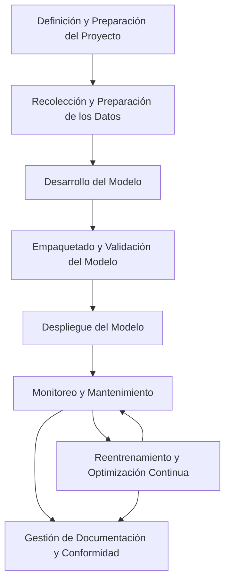

# Diagramas

## Diagrama MLOps

```mermaid
graph TD
    A[Definición y Preparación del Proyecto]
    B[Recolección y Preparación de los Datos]
    C[Desarrollo del Modelo]
    D[Empaquetado y Validación del Modelo]
    E[Despliegue del Modelo]
    F[Monitoreo y Mantenimiento]
    G[Reentrenamiento y Optimización Continua]
    H[Gestión de Documentación y Conformidad]

    A --> B
    B --> C
    C --> D
    D --> E
    E --> F
    F --> G
    G --> F
    F --> H
    G --> H
```
